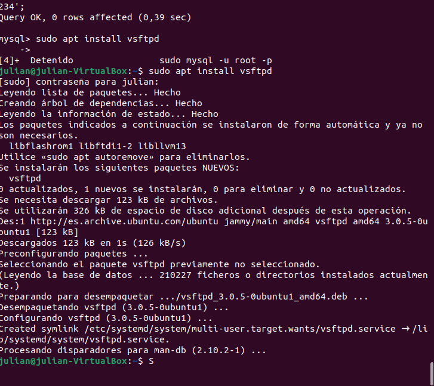

# Práctica 1: Servidor de alojamiento web

## Instalar vsftpd

Para instalar vsftpd primero ejecutamos el siguiente comando de instalación



Ahora iniciaremos el servicio

```
sudo systemctl start vsftpd
sudo systemctl enable vsftpd
```

Tambien nos hace falta instalar openssh-server


### Configuracion de servicios
Ahora crearemos un directorio para el sitio web y le damos permisos al directorio


Lo siguiente es crear el archivo de configuracion del sitio

Haciendo un nano  a esta dirección deberemos crear el siguiente archivo en la carpeta


Lo siguiente es activarlo con un enlace simbolico y reiniciar el servidor


Con un nano nos aseguramos de que el dominio esté en el archivo de hosts


Y vemos si funciona


Lo que sigue es configurar el vsftpd para el acceso FTP seguro o TLS

Hacemos un nano en /etc/vsftpd.conf y dejamos el archivo así


lo siguiente es reiniciar el servicio usando

```
sudo service vsftpd restart
```


### Automatización mediante scripts

primero miraremos el script de crear usuarios


Ahora iniciamos el script pero antes le damos permisos


Ahora para el sstema de acceso a ftp, ssh, smtp creamos el archivo sistema_acceso.sh


le damos permiso y lo ejecutamos

Al haberlo ejecutado anteriormente nos saldra que ya existe el usuario


Para este script necesitamos instalar bind usando
```
sudo apt install bind9
```


Ahora para automatizar los servidores DNS usaremos un script llamado servidor_DNS.sh


Damos permisos y ejecutamos


Ahora toca crear el Script para la creacion de bases de datos con permisos, para ello crearemos el archivo Base_Datos.sh


Permisos y ejecutamos


Ahora solo queda comprobarlo en phpmyadmin
Iniciamos sesion...


Y comprobamos que la base de datos ha sido creada correctamente


Lo último sería automatizar la habilitación de Python, así que crearemos el archivo Habilitar_python.sh


Permisos y ejecutamos


