# 1.instalación de Apache y configuración de hosts

#### Primero ejecutamos estos comandos para isntalar apache en nuestro equipo linux


```
sudo apt update

sudo apt install apache2
```


#### Ahora necesitamos editar el archivo hosts para añadir nuestros dominios, usando nano para editarlo en la consola

```
sudo nano /etc/hosts
```


# 2. Activar los módulos necesarios en Apache

#### activaremos algunos modulos necesario mediante los siguientes comandos

```
sudo a2enmod rewrite

sudo a2enmod ssl

sudo systemctl restart apache2
```


# 3. Instalar y configurar wordpress

#### Primero hemos de isntalar mysql y una lireria de apache junto a mysql server

```
sudo apt install mysql-server php libapache2-mod-php php mysql
```

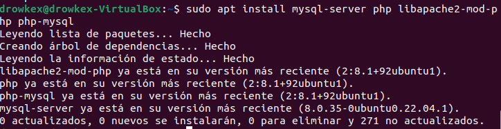

#### hacemos un wget a la siguiente dirección

```
wget https://wordpress.org/latest.tar.gz
```
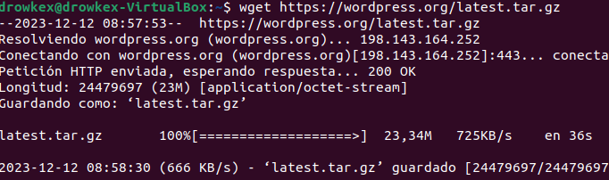

#### Lo siguiente es dar los permisos necesarios en el equipo a las carpetas de wordpress para que funcione correctamente

```
tar -xzvf latest.tar.gz
sudo mv wordpress /var/www/html/centro
sudo chown -R www-data:www-data /var/www/html/centro
sudo chmod -R 755 /var/www/html/centro
```

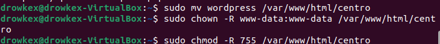

# 4. Activar modulo wsgi para python

#### Instalamos primero las dependencias necesarias

```
sudo apt-get install apache2 apache2-utils libexpat1 ssl-cert python
```

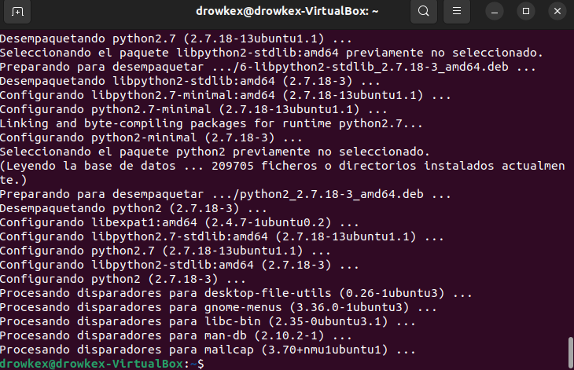

#### Instalamos el modulo

```
sudo apt install libapache2.mod.wsgi-py3

```

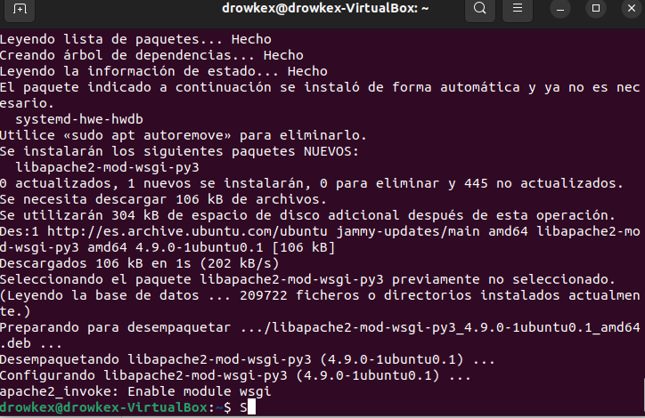

#### a continuacion habilitamos el modulo

```
sudo a2enmod wsgi
```

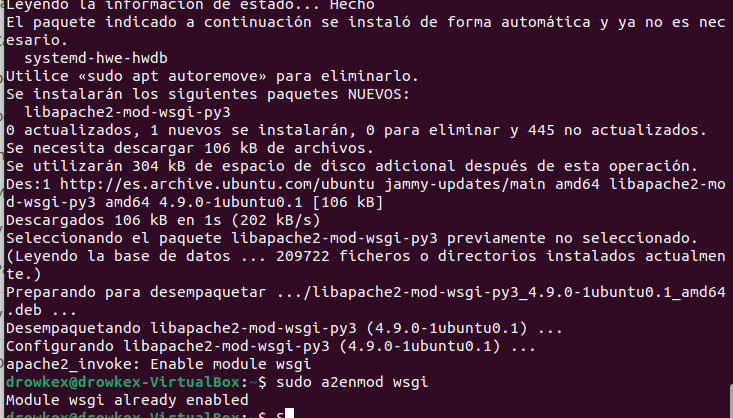

#### despues reiniciamos el servidor Apache con:

```
sudo systemctl restart apache2
```

# 5. Crear una aplicación python para probar

#### usando vi o nano podemos crear y editar un archivo en la carpeta var/www/html llamado test_script.py. Dicho archivo nos permitirá comprobar la correcta instalacion de python y sus dependencias

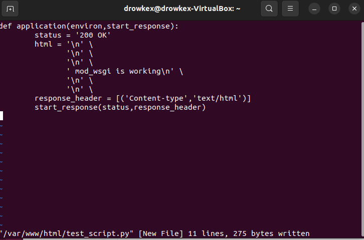

#### Ahora ejecutamos el siguiente comando para hacer que nuestro programa se ejecute mas tarde

```
$ sudo nano /etc/apache2/conf-available/mod-wsgi.conf
```
#### debemos añadir 'WSGIScriptAlias /test_wsgi /var/www/html/test_script.py' que es la localizacion de nuestro programa y su alias

#### A continuacion ejecutamos estos comandos

```
sudo a2enconf mod-wsgi
sudo systemctl restart apache2


```

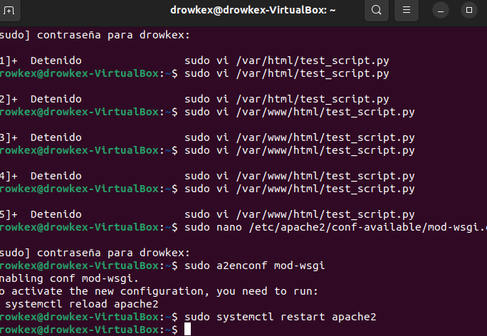

#### Ya solo quedaria ejecutar la aplicacion accediendo desde el navegador a nuestra dirección ip por ejemplo 'DireccionIP'://test_wsgi. Si se han seguido los pasos correctamente y todas las depencencias estan instaladas se mostrara un mensaje de OK como hemos indicado antes en el archivo

# 6. Instalar awstats

#### Para instalar el programa usamos

```
sudo apt-get install awstats
```

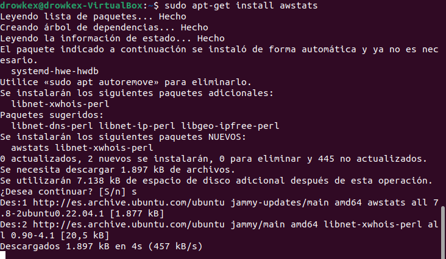

#### para configurarlo será necesario primero ejecutar este comando:

```
a2enmod cgi
```

#### ahora será necesario hacer un nano a a '/etc/apache2/sites-available/default'  y añadir lo siguiente al archivo:

```
Alias /awstatsclasses "/usr/share/awstats/lib/"
  Alias /awstats-icon "/usr/share/awstats/icon/"
  Alias /awstatscss "/usr/share/doc/awstats/examples/css"
  ScriptAlias /awstats/ /usr/lib/cgi-bin/
 Options +ExecCGI -MultiViews +SymLinksIfOwnerMatch
```

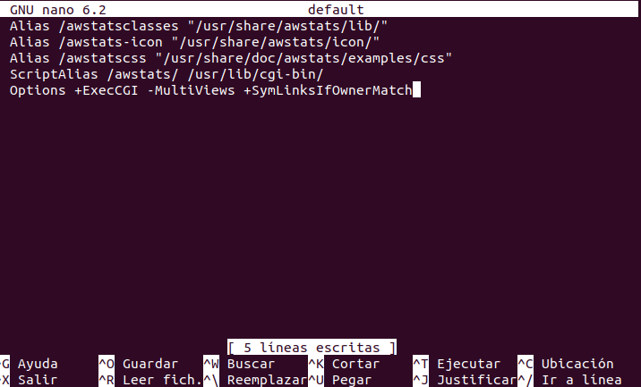

# 7. Instalar PHPMyAdmin

#### Ejecutamos este comando para instalarlo

```
sudo apt-get phpmyadmin
```

#### En la ventana que nos saldrá durante la instalacion seleccionaremos apache2 como servidor a configurar

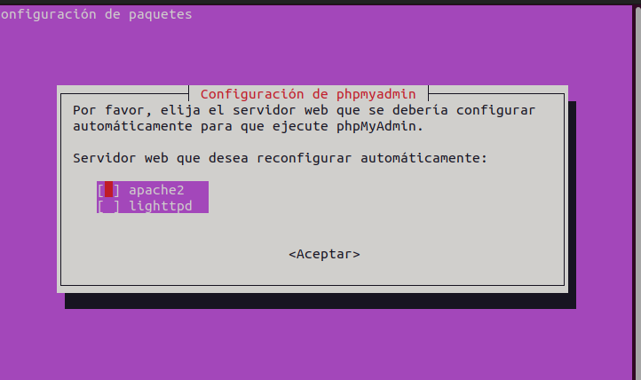

#### En los siguientes pasos solo quedaria pulsar si a todo y crear una contraseña para mysql

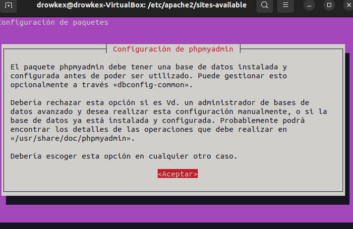


#### Una vez concluida la instalacion podremos acceder a PhpMyAdmin desde nuestra dirección IP seguido de 'phpmyadmin'

