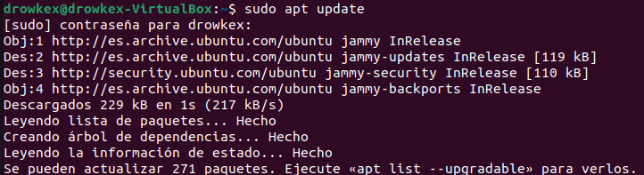
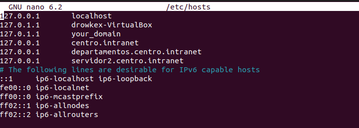
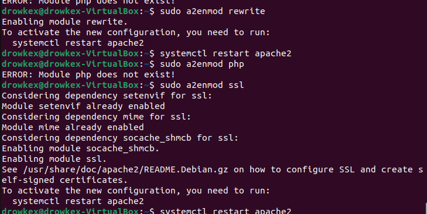

# 1.instalación de Apache y configuración de hosts

#### Primero ejecutamos estos comandos para isntalar apache en nuestro equipo linux


```
sudo apt update

sudo apt install apache2
```



#### Ahora necesitamos editar el archivo hosts para añadir nuestros dominios, usando nano para editarlo en la consola

```sudo nano /etc/hosts```




# 2. Activar los módulos necesarios en Apache

#### activaremos algunos modulos necesario mediante los siguientes comandos

```sudo a2enmod rewrite

sudo a2enmod ssl

sudo systemctl restart apache2```



# 3. Instalar y configurar wordpress

